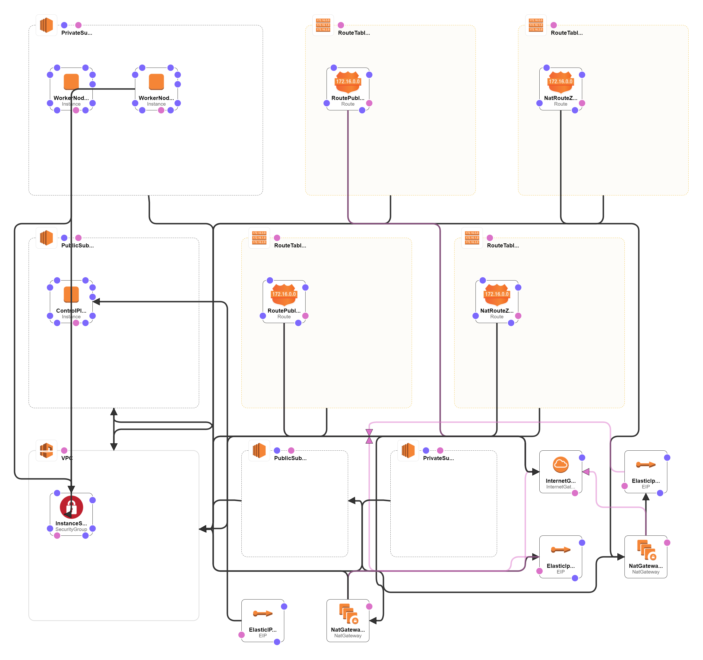

# AWS-Playground
 AWS Resources to deploy a K8S Cluster

> :warning: **Warning:** This provsions a t3.medium ec2 instance as control-plane and a NAT Gateway within the VPC. Even if you are using a AWS free-tier still costs will be included.
     

After terraform deploys into AWS Cloud there will be below resources will be created. 

1. A VPC with a NAT Gateway, Two Public Subnets, Two Private Subnets and an Internet Gateway
2. A security Group
3. Two EC2 Instances as below
   1. Control-Plane
   2. Worker Node

| Node          | OS            | InstanceType | Storage     | SubnetType  | EIP         |
| ------------- | ------------- | ------------ | ----------- | ----------- | ----------- |
| Control-Plane | Ubuntu 20.04  | t3.small     | 10GB        | Public      | Yes         |
| Worker-Node-1 | Ubuntu 20.04  | t2.micro     | 10GB        | Private     | No          |

----------------------------------------------------------------------------------------------------------------------------------------------

:bulb: **Tip:** Note that you can change the Worker node number to be deployed by changing the <em>terraform.tfvars file's worker_nodes_count parameter</em>.

----------------------------------------------------------------------------------------------------------------------------------------------

#### Below is a sample diagram after AWS resources deployed

#### Terraform commands to run.

     terraform init
     terraform fmt
     terraform validate
     terraform terraform plan
     terraform apply -auto-approve
